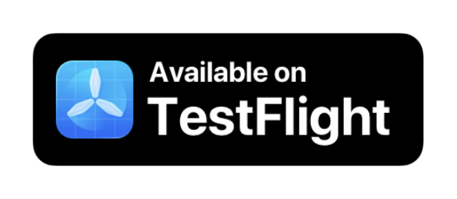
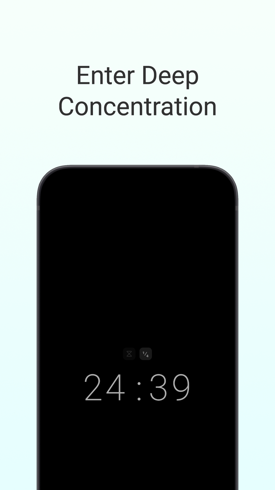
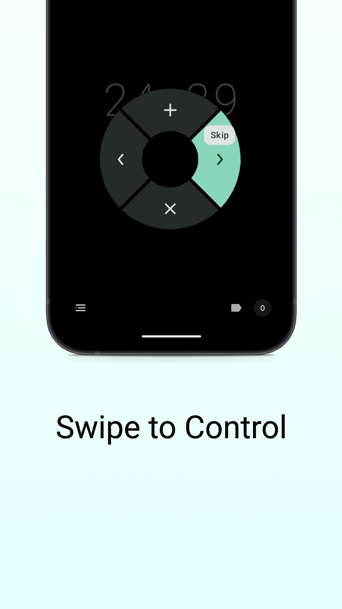
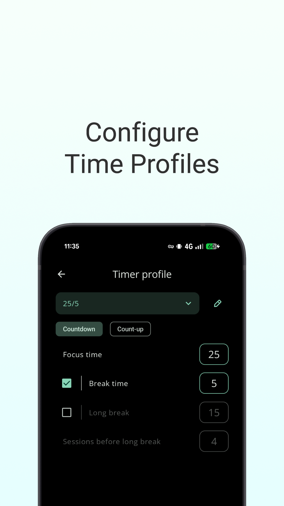
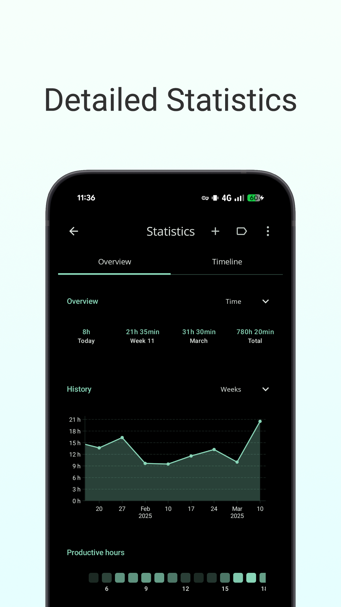
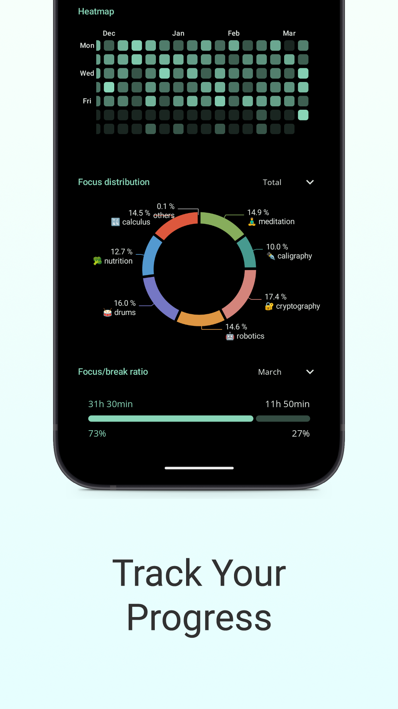
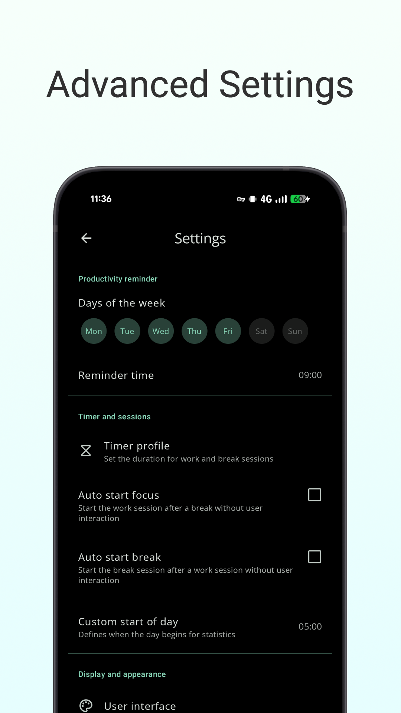

 

# [Goodtime](https://goodtime.tools/)
**A minimalist but powerful productivity timer designed to keep you focused and free of distractions.**

🧠 **Achieve Focus & Boost Productivity** - Simple, Private, Open-Source.

Goodtime is an indie open-source minimalist productivity timer - lightweight, ad-free and tracking-free.

Perfect for students needing a study timer, professionals seeking deep work and time management, and anyone fighting distractions and procrastination.

  
  
  
  

  
  
  

## Features

### Productivity Modes

- 🍅 **Pomodoro Timer**: Work in structured focus sessions followed by short breaks to keep your mind sharp. Boost study efficiency.
- ☕ **Longer Breaks**: Take longer breaks after several pomodoro sessions to fully recharge and maintain a high level of productivity.
- ⏳ **Count-up Flow Timer**: Track your uninterrupted time and accumulate a break budget as you reach a flow state. Take a break when ready.

### Control & Time Tracking

- **Configurable Timer**: Match the timer to your preferred workflow. Pause, skip, or add extra time with intuitive swipe gestures.
- **Minimalist Design**: Clean interface helps you focus without distractions.
- **Detailed Statistics**: Track your accumulated focus time and quantify your productivity. Set a daily reminder and customize the start of the day/week.
- **Focus Protection**: Use Do Not Disturb mode during study sessions.

### Premium Features

- **Labels & Customization**: Assign colored labels, archive, and fully customize the timer display.
- **Pro Statistics**: Label-based visualization, manual session editing, and notes.
- **Backup & Export**: Keep your data safe and portable.
- **Advanced Alerts**: Screen flash, torch, and persistent notifications.

## Trouble with Goodtime getting killed by Android?
Different phone [OEMs](https://en.wikipedia.org/wiki/Original_equipment_manufacturer) (phone vendors) have an aggressive take towards apps that rely on background work and alarms to save some battery life.
It is recommended that you disable the battery optimization for this app in order to get accurate alarms.
In the worst case, if you still have issues, try to keep the phone plugged in and/or the screen on while working.

Read more about this topic on [www.dontkillmyapp.com](https://dontkillmyapp.com/)